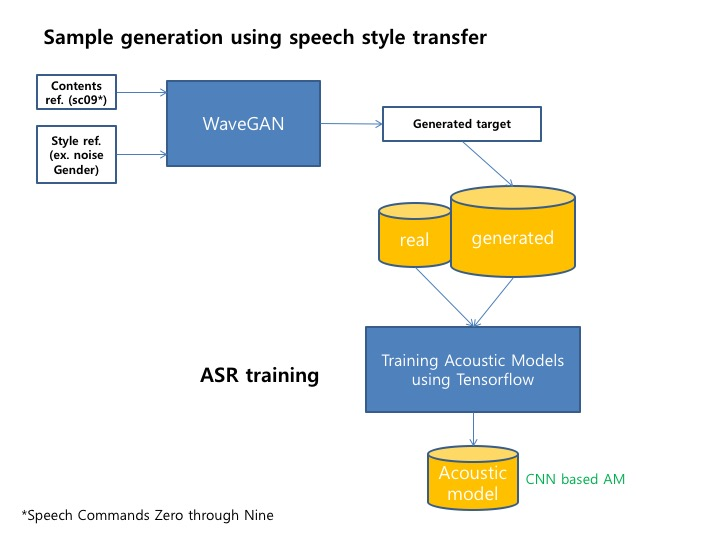
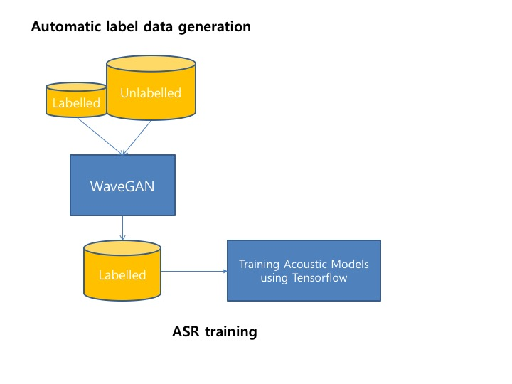

# Improving speech recognition accuracy using sythesized speech output from semi supervised GANs

In this project we use Deep learning to synthesis speech/audio using WaveGAN and SpecGAN ([paper](https://arxiv.org/abs/1802.04208)). The thus synthesized raw audio is used for improving the baseline system. 

## Getting Started

Most of the deep learning techniques needs huge data to train the system. But to collect data large scale is a bottleneck. Not only one must have data but also it should be able to cover the various scenarios happening in the real world. Suppose there is a way to generate new data from existing data (labeled as well as unlabeled). Here in this work I explore that possiblity in speech domain. Recently a lot of work in Speech Recognition were focused on Speech Synthesis. A flury of paper has been coming since the introduction of GANs by Goodfellow, Ian, et al (2014) and later used it successfuly in style transfer for Images. Style transfer for Images have since then kicked off. Recenlty WaveGAN and SpecGAN were used by researchers at UC San Diego for generating meaningful audio data ([samples](http://wavegan-v1.s3-website-us-east-1.amazonaws.com/))

## Proposed System

## Usage

### Prerequisites

* Tensorflow >= 1.4
* Python 3.6

### Datasets

1. Noisy [DEMAND](https://zenodo.org/record/1227121) [2](http://staff.ustc.edu.cn/~jundu/The%20team/yongxu/demo/115noises.html)
2. [Speech Commands Zero through Nine (SC09)](https://drive.google.com/open?id=1qRdAWmjfWwfWIu-Qk7u9KQKGINC52ZwB)
3. Techsorflow Challenge [Speech Commands data full](https://www.kaggle.com/c/tensorflow-speech-recognition-challenge/data)

### Baseline Speech Recognition System

We are using the isolated word recognition with a vocab size of 10. [baseline](https://www.tensorflow.org/tutorials/audio_recognition) [paper](https://www.isca-speech.org/archive/interspeech_2015/papers/i15_1478.pdf)

### GAN based Speech Synthesis system

We are using WaveGAN and SpecGAN for speech Synthesis from the training data. [github](https://github.com/chrisdonahue/wavegan)

### References

* Donahue, Chris, Julian McAuley, and Miller Puckette. "Synthesizing Audio with Generative Adversarial Networks." arXiv preprint arXiv:1802.04208 (2018). [paper](https://arxiv.org/abs/1802.04208)
* Shen, Jonathan, et al. "Natural TTS synthesis by conditioning wavenet on mel spectrogram predictions." arXiv preprint arXiv:1712.05884 (2017). [paper](https://arxiv.org/pdf/1712.05884.pdf)
* Perez, Anthony, Chris Proctor, and Archa Jain. Style transfer for prosodic speech. Tech. Rep., Stanford University, 2017. [paper](http://web.stanford.edu/class/cs224s/reports/Anthony_Perez.pdf)
* Goodfellow, Ian, et al. "Generative adversarial nets." Advances in neural information processing systems. 2014. [paper](https://arxiv.org/pdf/1406.2661.pdf)
* Salimans, Tim, et al. "Improved techniques for training gans." Advances in Neural Information Processing Systems. 2016. [paper](https://arxiv.org/pdf/1606.03498.pdf)
* Grinstein, Eric, et al. "Audio style transfer." arXiv preprint arXiv:1710.11385 (2017). [paper](https://arxiv.org/abs/1710.11385)
* Pascual, Santiago, Antonio Bonafonte, and Joan Serra. "SEGAN: Speech enhancement generative adversarial network." arXiv preprint arXiv:1703.09452 (2017). [paper](https://arxiv.org/pdf/1703.09452.pdf)
* Yongcheng Jing, Yezhou Yang, Zunlei Feng, Jingwen Ye, Yizhou Yu, Mingli Song. "Neural Style Transfer: A Review" 	arXiv:1705.04058 (2017) [paper](https://arxiv.org/abs/1705.04058v6)
* Van Den Oord, Aäron, et al. "Wavenet: A generative model for raw audio." CoRR abs/1609.03499 (2016). [paper](https://arxiv.org/abs/1609.03499)
* Glow: Generative Flow with Invertible 1×1 Convolutions [paper](https://d4mucfpksywv.cloudfront.net/research-covers/glow/paper/glow.pdf)
* Kingma, Diederik P., et al. "Semi-supervised learning with deep generative models." Advances in Neural Information Processing Systems. 2014. [paper](https://arxiv.org/abs/1406.5298)
* Van Den Oord, Aäron, et al. "Wavenet: A generative model for raw audio." CoRR abs/1609.03499 (2016). [paper](https://arxiv.org/abs/1609.03499)

## Authors

* **Chae Young Lee** - *Hankuk Academy of Foreign Studies* - [Homepage](https://github.com/acheketa)
* **Anoop Toffy** - *IIIT Bangalore* - [Personal Website](www.anooptoffy.com)

## License

This project is licensed under the MIT License - see the [LICENSE.md](LICENSE.md) file for details

## Acknowledgments

* Dr. Gue Jun Jung, Speech Recognition Tech, SK Telecom
* Tensorflow Korea
* Google Korea
* SK Telecom
