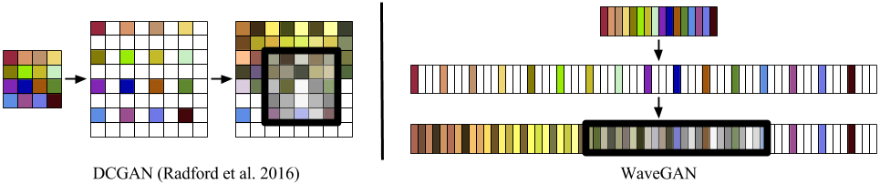
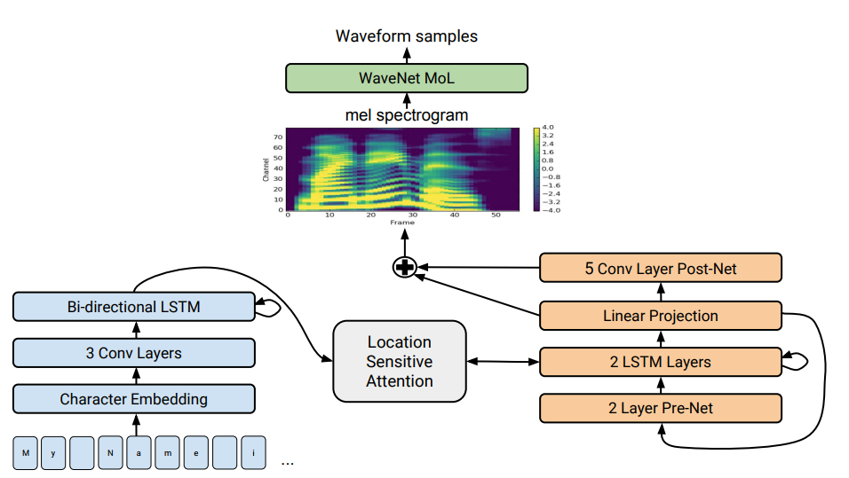

# Literature survey

Details on a few advancement in the field of humanlike speech synthesis.

# Table of Contents

1. WaveGAN and SpecGAN
2. Tacotron 2
3. Style Transfer Audio
4. Glow 

## Details

### WaveGAN and SpecGAN [paper](https://arxiv.org/abs/1802.04208)

#### Architecture

Listen to WaveGAN demo here [website](http://wavegan-v1.s3-website-us-east-1.amazonaws.com/)

### Tacotron 2 [paper](https://arxiv.org/pdf/1712.05884.pdf)

#### Architecture

Listen to the audio generated from Tacotron2 model from Google AI Team [website](https://google.github.io/tacotron/publications/tacotron2/index.html)

All Tacotron based discussions summarized here, https://google.github.io/tacotron/index.html

### Glow : Better Reversible Generative Models

Moving towards better reversible generative models from Open AI is a promising research. It is currently applied to images.

[link](https://blog.openai.com/glow

## Applications

* TTS - text-to-speech Systems
* Smart Devices like Google Home, Amazon Echo
* Speaker Adaption
* Music Generation/Synthesis
