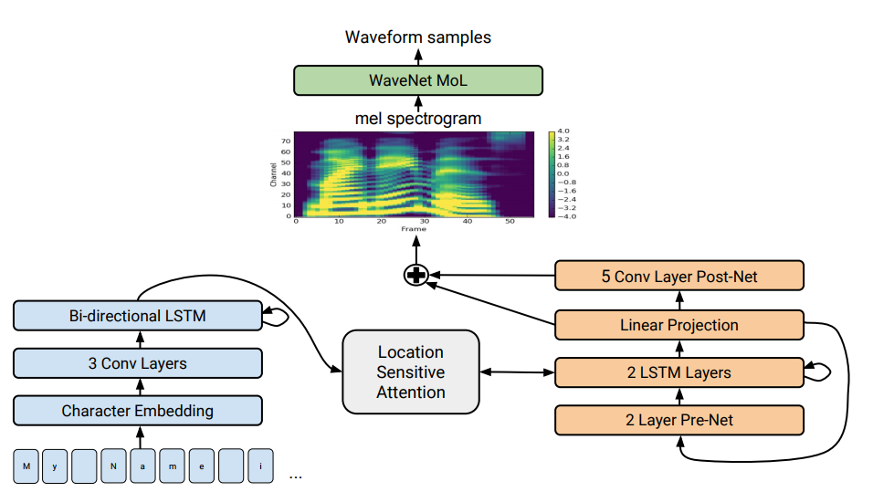

# Literature survey

Details on a few advancement in the field of humanlike speech synthesis.

# Table of Contents

1. WaveGAN and SpecGAN
2. Tacotron 2
3. Style Transfer Audio

## Details

### WaveGAN and SpecGAN [paper](https://arxiv.org/abs/1802.04208)

#### Architecture

Listen to WaveGAN demo here [website](http://wavegan-v1.s3-website-us-east-1.amazonaws.com/)

### Tacotron 2 [paper](https://arxiv.org/pdf/1712.05884.pdf)

#### Architecture

Listen to the audio generated from Tacotron2 model from Google AI Team [website](https://google.github.io/tacotron/publications/tacotron2/index.html)

## Applications

* TTS - text-to-speech Systems
* Smart Devices like Google Home, Amazon Echo
